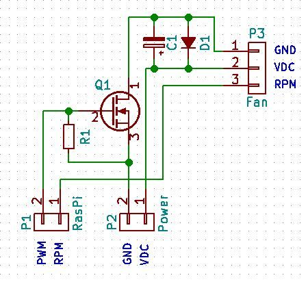
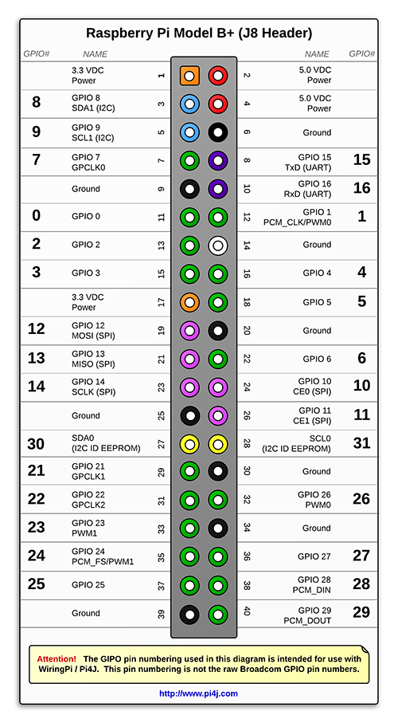

# Raspberry Pi Fan Controller

*Fan Controller* is designed to drive a PWM fan on a Raspberry Pi proportionally to the CPU temperature. It is designed to use very low resources and be totally configurable.

The latest Rasberry Pi versions are more powerful but they also need a fan. It is noisy and needs power. The purpose of this application is to run the fan as less as possible using as few Rasberry Pi resources as possible.

Copyright (C) 2020 Simone Pernice <pernice@libero.it>. 

*Fan Controller* is provided under GNU General Public License version 3 as published by the Free Software Foundation.

*Fan Controller* is programmed in C++ for maximum energy efficiency. Other programming languages like Java or Python would have required much more memory and CPU cycles to perform the same tasks. 
*Fan Controller* has plenty of configuration options to adapt at every load condition. 
*Fan Controller* wants to fresh Raspberry while it is executing complex tasks, it does not want to be the reason for heating!!!

*Fan Controller* requires the following libraries:

* [GNU C++ standard library](https://gcc.gnu.org/onlinedocs/libstdc++/)
* [libconfig](https://hyperrealm.github.io/libconfig/) Copyright (C) 2005-2018  Mark A Lindner
* [WiringPi](http://wiringpi.com/) Copyright (C) Gordon Henderson v 2.52 (2.50 does not work on latest Raspberry Pi 4B)

*Fan Controller* is built mainly with the following tools:

* [Code::Blocks 17.12](www.codeblocks.org) 
* [GNU C++ compiler  6.3.0](https://gcc.gnu.org/) Copyright (C) 2016 Free Software Foundation, Inc.

*Fan Control* runs as a `systemd` service  in back ground. 

#Introduction

*Fan Controller* drives a fan with a PWM signal on a GPIO pin of Raspberry header. 

*Fan Controller* monitors the CPU temperature and compares it against a temperature interval. 

* If the CPU temperature is below that interval: the PWM is set to 0% -> no fan noise/power drain
* If the CPU temperature drops within that interval: the PWM duty cycle is set proportionally to the temperature -> minimum acceptable noise/power drain
* If the CPU temperature is above that interval: the PWM is set to maximum -> maximum noise and power drain

*Fan Controller* checks the CPU temperature every once in a while depending on its variation rate. The more stable the temperature the less frequent the check in order to reduce the Raspberry resource requirement. 

* If there was a temperature change exceeding the maximum temperature variation expected -> the maximum check rate is used
* If there was a temperature change lower than the maximum temperature variation expected -> the check rate is linearly estimated to reach the maximum temperature variation expected at next read. Howeve if ths time is shorter than the minimum check rate, it is used instead

*Fan Controller* manages a log file `/var/log/fancontroller.log` where it writes all the actions executed to keep the CPU fresh. Its purpose is to validate the settings, logging can be disabled once the configuration works properly to save computational power.

*Fan Controller* can be lunched with arguments. In that mode, it is used to calibrate fan parameters (control pin, frequency, duty cycle, full power turn on timing). 

*Fan Controller* works as service if lunched without arguments. It is automatically lunched at startup by the `systemd`. In that mode it run the PWM for the fan to keep Raspberry fresh. 

#Fan adaptor

Usually the fan has 2 wires: positive and negative. It needs an adaption circuit to be controlled in PWM by a GPIO. Basically, a little transistor, an NMOS or a NPN BJT, is used to open and close the fan ground connection. If it happens quickly, the fun rotates at a speed proportional to the duty cycle of the PWM signal. 

The adaption circuit needs the following components:

* a transistor, a small current NMOS with 2V VTH and > 20V VDSMAX should be fine
    * it can be used a NPN BJT instead but the circuit would be slightly different (base instead of pull-down resistor) and less efficient
* a resistor for pull-down, 100kOhm or more
    * it is not strictly required because driven in push-pull but still suggested, if for instance the pin is disconnected
* a Shottky diode
    * it is used to recirculate fan current every time its circuit is opened, it avoids overvoltages that may damage the transistor

Those components should be linked as follow:

* The negative wire, coming from the fan, is linked to NMOS drain
* The NMOS source goes to Raspberry GND 
* The NMOS gate goes to raspberry GPIO for PWM controllcan
* The pull-down resistor links the transistor gate (GPIO) and source (GND)
* The Shottky diode is linked with anode on the transistor drain and positive on the fan positive line 

There are plenty of schematic online showing how to make this adaptor. A simple example I found online follows: 

#Start up option

Once the fan is linked to Raspberry, it is required some calibration. *Fan Controller* command line arguments can be used for the purpose. 

The target is to :

* Verify the pin at which the fan is linked 
* Find the smalles frequency to drive the fan because the higher the frequency, the more resouce are required to raspberry, try in the range of 10 to 100Hz
* Find the minimum duty cycle to drive the fan, it is used at fan start when the CPU temperature begins to rise
* How long keep the PWM at 100% at first start up. It is done because, due to inertia, the fan may not be able to start at minimum duty cycle

Link the fan adapter to 5V, GND and to a Raspberry GPIO. On the next picture it is possible to find the pins naming convention used by *Fan Controller* (since it is based on WiringPi): 

The arguments used to configure *fan controller* are the followings:

* p followed by the pin number at which the fan PWM is linked
    * it is the pin numbered as the picture above
* f followed by the PWM frequency
    * it should be low to avoid the use a lot of resources
* d followed by the duty cycle
    * it can be used to check the minimum starting dc
* s followed by the milli-seconds of 100% dutycycle at turn on
    * if not specified the default value is 1000 milli-seconds
    * if the minimum duty cycle is too low, the fan may not run. To avoid that, *Fan Controller* starts the fan at 100% duty cycle for a short period, before setting the required dc. This parameter can be used together with minimum duty cycle to calibrate fan start up
* t followed by the seconds the test should last
    * after t seconds *Fan Controller* turns the fan off and exits
    * if not specified the default value is 10 seconds

#Configuration settings

At startup, *Fan Controller* searches for a configuration file located on `/etc/fancontroller.cfg`. That file contains all the parameters used to controll the fan. If the file is not found or if some parameter is missing, its default value is used instead.

* pinnumber
    * default 14
    * it is the pin at which is linked the fan PWM input signal
* pwmfrequencyhz
    * default 10
    * measurement unit Hertz
    * it is the PWM frequency, as the frequency rises, it needs more Raspberry reasources, avoid exceeding 100Hz
* tempminc
    * default 45 
    * measurement unit Celsius degree
    * it is the minimum temperature above which the fan turns on at minimum duty cycle
* tempmaxc
    * default 60
    * measurement unit Celsius degree
    * it is the maximum temperature above which the fan runs at maximum duty cycle
* dutycycleminpr
    * default 20
    * measurement unit percentage 
    * it is the minimum duty cycle used when the temperature reaches tempminc
* dutycyclemaxpr
    * default 100 
    * measurement unit percentage 
    * it is the maximum duty cycle used when the temperature exceeds tempmaxc
* maxpowturnontimems
    * default 500
    * measurement unit milliseconds 
    * every time the fan starts from off, it is run at 100% duty cycle for this time to avoid inertia problem starting at low duty cycle 
* checkperiodmaxs
    * default 60
    * measurement unit second 
    * it is the maximum time between two temperature checks
* checkperiodmins
    * default 1
    * measurement unit second 
    * it is the minimum time between two temperature checks
* checkmaxdeltatempc
    * default 2 
    * measurement unit Celsius degree 
    * it is the maximum temperature change expected between readings, if the delta exceeds that value, the time between checks is proportionally reduced (down to checkperiodmins), otherwise it is proportionally incremented (up to checkperiodmaxs)
* logenabled
    * default false
    * type boolean (true or false)
    * if true a log file is written on `/var/log/fancontroller.log`
* loglevel
    * default 1
    * type integer (1 to 5) 
    * it sets how many internal parameters write on the log file, the higher the number the verboser is the log file

#Logging parameters

The log file is saved on `/var/log/fancontroller.log`. If the maximum number of line is exceeded, the old version is saved to `/var/log/fancontroller.log.1` and the base file is cleaned.

The purpose of the log file is to check the *fan controller* parameters are correct, once the settings are good, it is suggested to disable the logging to avoid extra computational effort.

The log file provides these pieces of information:

* CPU temperature and PWM percentage
    * loglevel 0 print it only when it changes
    * loglevel 2 print it at every check
* Temperature check period 
    * loglevel 1 print it only when it changes
    * loglevel 4 print it at every check

